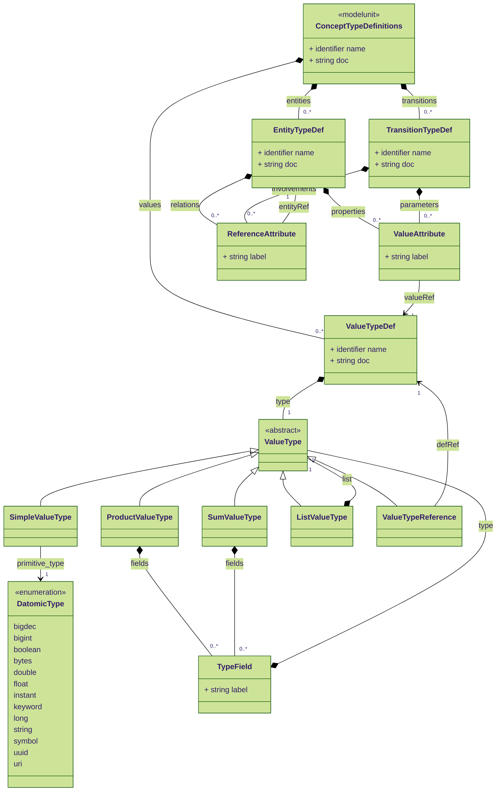

# Class diagram for language MuDForM_Model

```mermaid
    %%{init: {'theme': 'forest'} }%%
    classDiagram
    direction TD
    %% other possibilites: LR RL DT TB (same as TD)
    class ValueTypeDef {
        
        + identifier name
		+ string doc
    }
    class ValueType {
        <<abstract>>
        
    }
    class SimpleValueType {
        
        
    }
    class DatomicType {
        <<enumeration>>
        bigdec
		bigint
		boolean
		bytes
		double
		float
		instant
		keyword
		long
		string
		symbol
		uuid
		uri
    }
    class ProductValueType {
        
        
    }
    class SumValueType {
        
        
    }
    class TypeField {
        
        + string label
    }
    class ListValueType {
        
        
    }
    class ValueTypeReference {
        
        
    }
    class EntityTypeDef {
        
        + identifier name
		+ string doc
    }
    class TransitionTypeDef {
        
        + identifier name
		+ string doc
    }
    class ValueAttribute {
        
        + string label
    }
    class ReferenceAttribute {
        
        + string label
    }
    class ConceptTypeDefinitions {
        <<modelunit>>
        + identifier name
		+ string doc
    }

    ConceptTypeDefinitions *-- "0..*" ValueTypeDef : values

		ConceptTypeDefinitions *-- "0..*" EntityTypeDef : entities

		ConceptTypeDefinitions *-- "0..*" TransitionTypeDef : transitions

        
    ValueType <|-- SimpleValueType
ValueType <|-- ProductValueType
ValueType <|-- SumValueType
ValueType <|-- ListValueType
ValueType <|-- ValueTypeReference

        ValueTypeDef *-- "1" ValueType : type
ProductValueType *-- "0..*" TypeField : fields
SumValueType *-- "0..*" TypeField : fields
TypeField *-- "1" ValueType : type
ListValueType *-- "1" ValueType : list
EntityTypeDef *-- "0..*" ValueAttribute : properties

		EntityTypeDef *-- "0..*" ReferenceAttribute : relations
TransitionTypeDef *-- "0..*" ValueAttribute : parameters

		TransitionTypeDef *-- "0..*" ReferenceAttribute : involvements

        SimpleValueType --> "1" DatomicType : primitive_type
ValueTypeReference --> "1" ValueTypeDef : defRef
ValueAttribute --> "1" ValueTypeDef : valueRef
ReferenceAttribute --> "1" EntityTypeDef : entityRef

        
```
