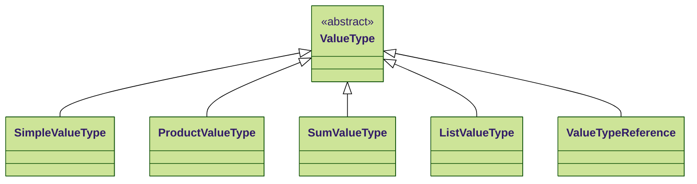

# Inheritance diagram for language MuDForM_Model

```mermaid
    %%{init: {'theme': 'forest'} }%%
    classDiagram
    direction TD
    %% other possibilites: LR RL DT TB (same as TD)
    class SimpleValueType {
        
        
    }
    class ValueType {
        <<abstract>>
        
    }
    class ProductValueType {
        
        
    }
    class SumValueType {
        
        
    }
    class ListValueType {
        
        
    }
    class ValueTypeReference {
        
        
    }
    ValueType <|-- SimpleValueType
ValueType <|-- ProductValueType
ValueType <|-- SumValueType
ValueType <|-- ListValueType
ValueType <|-- ValueTypeReference

```
