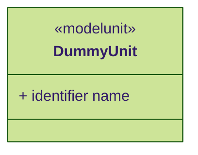

# Class diagram for language StarterModel

```mermaid
    %%{init: {'theme': 'forest'} }%%
    classDiagram
    direction TD
    %% other possibilites: LR RL DT TB (same as TD)

    class DummyUnit {
        <<modelunit>>
        + identifier name
    }

    
        
    
        
        
        
```
